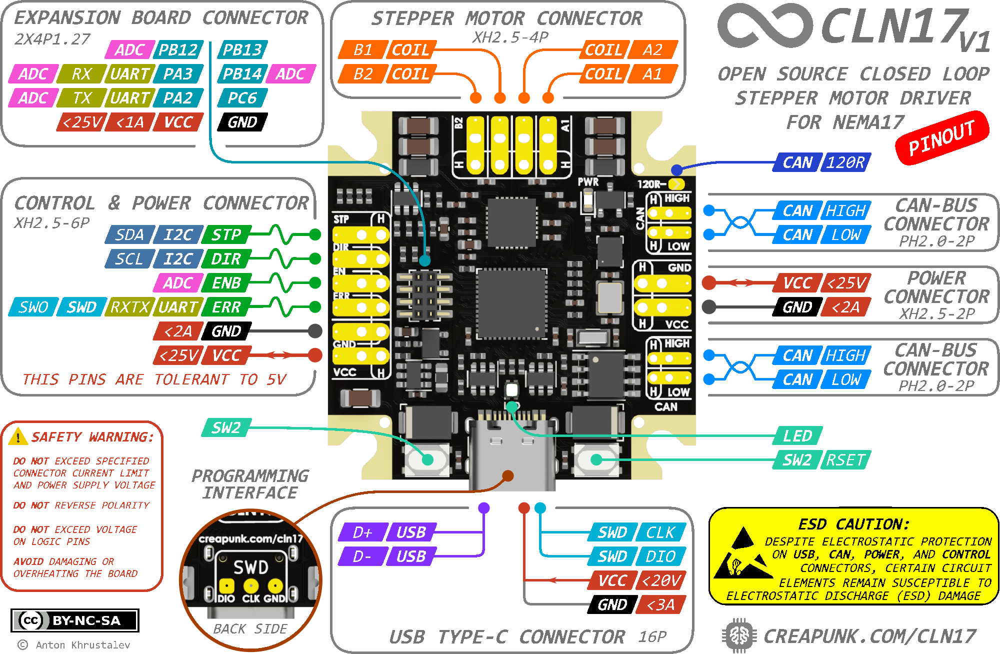

# CLN17 - CLOSED-LOOP DRIVER FOR NEMA17

[CLN17 cncept video](http://www.youtube.com/watch?v=A67UROq0t6Q)

# Project Overview

The CLN17 motor driver is an **open-source**, compact, high-performance closed-loop stepper motor driver designed specifically for NEMA17 form factor motors. The driver offers advanced features such as silent and smooth motion, high-precision position control, and energy-saving capabilities, making it ideal for various applications, including robotics, CNC machines, and 3D printers. 

Detailed documentation at [creapunk.com](https://creapunk.com)!

## Board Diagram

## Key Features

- 🕹️ **Closed-Loop Control:** Enables precise motion in challenging conditions.
- 💪 **Adaptive Torque Control:** Optimizes energy efficiency, reduces stress, and extends motor lifespan.
- 🧩 **Reliable Operation and Enhanced Safety:** Ensures reliable operation and protects users from potential harm.
- 🛡️ **Modular Concept:** Provides flexibility and cost-effectiveness through various configurations and expansion boards.

## Key Specs

- 🔌 **Wide Input Voltage Range:** 5-25VDC with reverse polarity and surge protection
- ⚡️ **Powerful Motor Control:** 1.4A RMS current per phase with up to 2.5A peak and up to 1/256 microstepping
- 🚀 **High-Performance MCU:** STM32G431CB Arm Cortex-M4 running at 170MHz with Classic EN/DIR/STEP interface, CAN-Bus, I2C, UART and USB Type-C with PD2.0 support,
- 🔒 **Compact and Durable Design:** 38x38mm PCB, with optional aluminum housing for heat dissipation and mechanical protection and minimal height of 7.5mm (10mm with connectors)

## Applications

- 🎓 Learning Platforms
- 🛠️ CNC Machines & 3D printers
- 🤖 Robotics & Automation Systems
- 🤝 Collaborative Robots
- 🔭 Camera & Telescope Stabilization Systems
- 🔬 Laboratory Equipment
- 🏭 Industrial Motion Control Systems
- 📳 Haptics & Force Feedback Systems

------

### Support the Project!

**If you like the project and want to support its development, you can do so through:**

- **[Ko-fi](https://ko-fi.com/creapunk)** (*preferred for membership subscription and one-time donation*) - here, you can sign up for monthly support, or you can make a one-time donation as well!
- **[Patreon](http://patreon.com/creapunk)** - similar to Ko-fi, but with higher fees.

Don't forget to join **[creapunk community on Discord](https://discord.gg/4uFSsffhMt)** for the latest updates and discussions!
