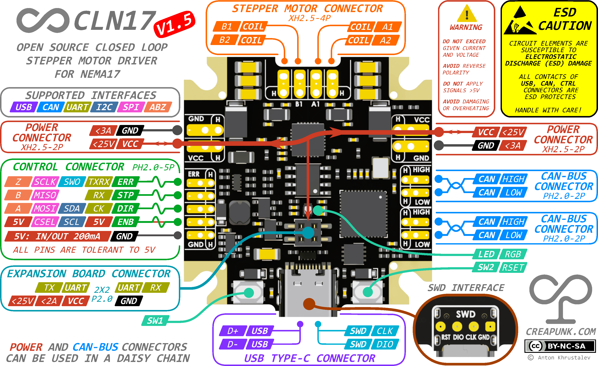

#  CLN17 V1.5 HARDWARE

Compact driver for NEMA17, a corrected and improved version of CLN17 V1.0, suitable for 12V and 24V systems with a current of up to 1.4A RMS.

`STATUS` As of January 2024, the [board's functionality has been confirmed](#tested-hardware-features), with no problems identified. Firmware is in progress.

- [`Specification`](/wiki/CLN17/V1.5/specification.md)
- [`PCBA Manufacturing`](#pcba-manufacturing-specification)

------

### Board Diagram

------

### Attention!

> - **Uncompleted firmware:** Firmware of CLN17 V1.5 driver is in active development. May contain unforeseen issues.
>
> - **Potential Design Changes:** The design may undergo minor modifications in the future.
>
> - **No Author Liability:** The author bears no responsibility for any damages resulting from incorrect usage, connections, manufacturing faults, or coding errors.
>
> - **User's Duty:** Users must conduct comprehensive tests in their specific environments. Adherence to provided usage guidelines is crucial.

------

### Tested hardware features

Driver IC:

- ✅ TMC2209 STEP-DIR, UART SW bidirectional communication, Reset + Disable functionality
- ✅ Freewheeling when unpowered
- ✅ Analog Current sensing

Encoder IC:

- ✅ TLE5012 SPI communication
- ✅ TLE5012 through the PCB position sensing (1LSB noise)

Power:

- ✅ Daisy Chain Power connection
- ✅ DCDC stability at voltage range [External: 5.2V-25V, USB: 4.9V-5.5V]
- ✅ ENB CLTR 5V (Power Sink & Source 5V 200mA)

Interfaces:

- ✅ USB communication
- ✅ CTRL connector - UART, I2C, SPI communication (ABZ not tested yet)
- ✅ CAN-Bus IC Shutdown and Logic supply, diff signal generation
- ✅ Expansion connector - UART communication
- ✅ SWD with reset functionality

Peripherals:

- ✅ SW1 & SW2 as button
- ✅ RESET using SW2 as output
- ✅ RGB LED (single color indication)
- ✅ External Precise Clock (10ppm) (HSE)

------

### PCBA Manufacturing Specification

- **Layers**: 4
- **Minimum Via Hole Size/Via Diameter**: 0.25mm/0.41mm
- **Minimum track width/spacing**: 0.19mm/0.2mm\
- **Material**: FR4
- **PCB Thickness**: 1mm [preferred]
- **PCB Color**: Any, but black is more aesthetic.
- **PCB Surface Finish**: ENIG [preferred]
- **Outer/Inner Copper Weight**: 1oz/0.5oz
- **Via Covering**: Plugged [preferred] or Tented
- **Board Outline Tolerance**: ±0.2mm
- **Panelization**: optional, but if horizontal connectors used, the gap between boards should be ≥5mm.
- **Assembly**: Single top side
- **Tooling Holes**: Already present 4x D1.152mm in the corners of the board. May require modification for specific equipment.

#### Important Notes

> ***Non-stock Components Note:** The design features 3 irreplaceable components: the driver chip, microcontroller, and encoder. Other parts can be replaced with in-stock equivalents that match or surpass the original specs, provided you conduct a schematic review beforehand.*

> ***Cost Reduction Note:** Eliminate unused components such as the CAN-Bus or CTRL connector to reduce costs, provided you conduct a schematic review beforehand.*

> ***CAN-Bus Configuration Note:** Exclude R8 from the BoM and Pos files if your device isn't the final (termination) node in the CAN-Bus network, to avoid unnecessary 120Ω termination.*

------

### Support the Project!

**If you like the project and want to support its development, you can do so through:**

- **[Ko-fi](https://ko-fi.com/creapunk)** (*preferred for membership subscription and one-time donation*) - here, you can sign up for monthly support, or you can make a one-time donation as well!
- **[Patreon](http://patreon.com/creapunk)** - similar to Ko-fi, but with higher fees.

Don't forget to join **[creapunk community on Discord](https://discord.gg/4uFSsffhMt)** for the latest updates and discussions!

------

Special thanks to [JLCPCB](https://jlcpcb.com/?from=creapunk) for sponsoring the board manufacturing of this design!

