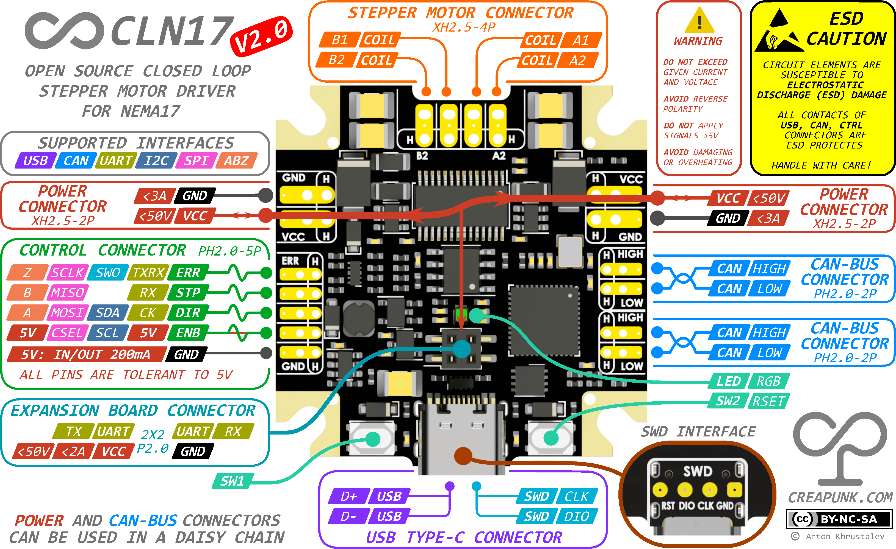

#  CLN17 V2.0 HARDWARE

Compact and powerful driver for NEMA17, an advanced version of CLN17, suitable for 12V, 24V, 36V, and 48V systems with a current of up to 1.75A RMS

`STATUS` As of March 2024, the [most board's functionality has been confirmed](#tested-hardware-features). Going for BETA. Once beta is complete, all production files and the original design files will be published.

- [`Specification`](/wiki/CLN17/V2.0/specification.md)

------

### Board Diagram

------

### Tested Hardware Features

Driver IC:

- ✅ DRV8844 PWM
- ⛔ Freewheeling when unpowered [NOT WORKING DUE TO DRIVER CHIP]
- ✅ Freewheeling when external powered
- 📅 Analog Current sensing
- ✅ FOC Support

Encoder IC:

- ✅ TLE5012 SPI communication
- ✅ TLE5012 through the PCB position sensing (1LSB noise)

Power:

- ✅ Daisy Chain Power connection
- ✅ DCDC stability at voltage range [External: 5.8V-25V, USB: 4.9V-5.5V]
- ✅ ENB CLTR 5V (Power Sink & Source 5V 200mA)

Interfaces:

- ✅ USB communication
- ✅ CTRL connector - UART, I2C, SPI communication (ABZ not tested yet)
- ✅ CAN-Bus IC Shutdown and Logic supply, diff signal generation
- ✅ Expansion connector - UART communication
- ✅ SWD with reset functionality

Peripherals:

- ✅ SW1 & SW2 as button
- ✅ RESET using SW2 as output
- ✅ RGB LED (single color indication)
- ✅ External Precise Clock (10ppm) (HSE)

------

### Support the Project!

**If you like the project and want to support its development, you can do so through:**

- **[Ko-fi](https://ko-fi.com/creapunk)** (*preferred for membership subscription and one-time donation*) - here, you can sign up for monthly support, or you can make a one-time donation as well!
- **[Patreon](http://patreon.com/creapunk)** - similar to Ko-fi, but with higher fees.

Don't forget to join **[creapunk community on Discord](https://discord.gg/4uFSsffhMt)** for the latest updates and discussions!

------

Special thanks to [JLCPCB](https://jlcpcb.com/?from=creapunk) for sponsoring the board manufacturing of this design!

