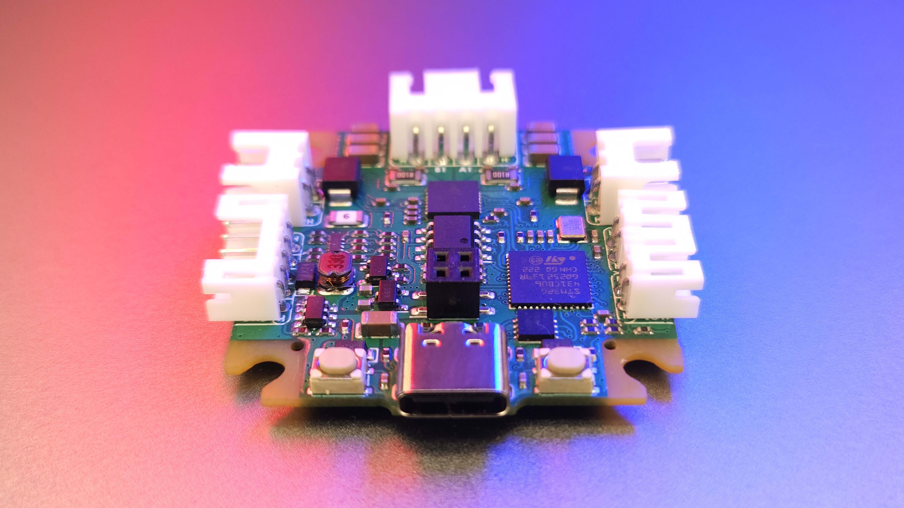
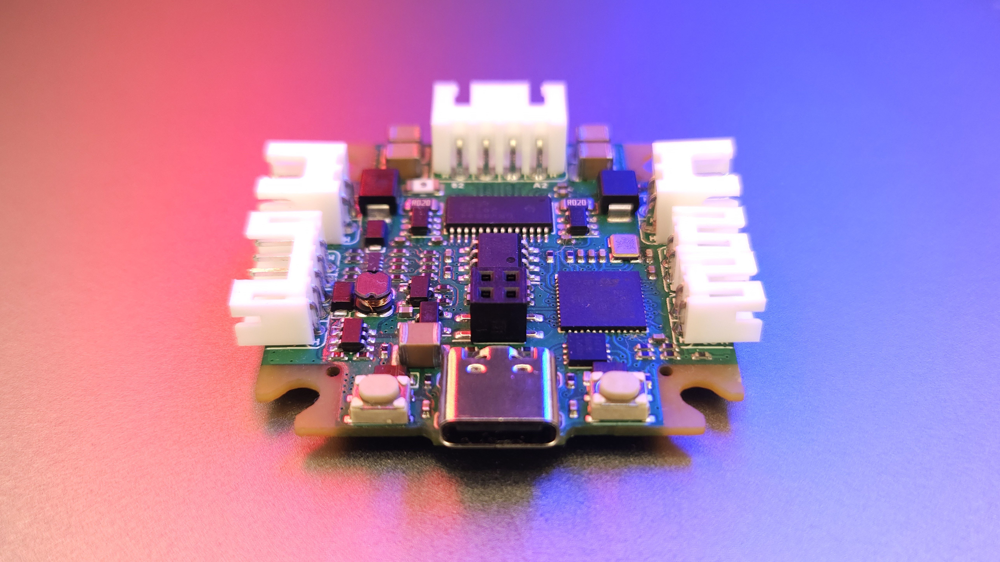

# CLN - CLOSED-LOOP DRIVERS FOR NEMA MOTORS

The CLN motor driver series is an **open-source** project aimed at creating a range of compact, cost-efficient high-performance closed-loop stepper drivers for various NEMA form factor motors. These drivers are designed to provide silent and smooth motion, high-precision position control, and energy-saving capabilities, suitable for a wide array of applications in robotics, CNC machines, 3D printers, and more.

## Key Features

- 🕹️ **Closed-Loop Control:** Integrates an encoder for real-time position monitoring, ensuring precise and safe motion.
- 📏 **Fine Positioning:** Achieves high position control accuracy of 0.01° for smooth operation.
- 🛡️ **Reliable Operation and Enhanced Safety:** Features integrated diagnostic and protection mechanisms for the motor and the user safety.
- 🧩 **Modular Concept:** Offers various configurations for different cost, size and performance needs, supporting expansion boards and daisy chain connections.

## Applications

- 🎓 Learning Platforms
- 🛠️ CNC Machines & 3D printers
- 🤖 Robotics & Automation Systems
- 🤝 Collaborative Robots
- 🔭 Camera & Telescope Stabilization Systems
- 🔬 Laboratory Equipment
- 🏭 Industrial Motion Control Systems
- 📳 Haptics & Force Feedback Systems

## Repository Structure

- **[`wiki`](wiki)**: includes design documentation and other information
- **[`hardware`](hardware)**: contains design source files, manufacturing files, schematics, block diagrams and 3D models
- **[`firmware`](https://github.com/creapunk/TunePulse)**: [to be updated as the project evolves]

## Hardware Versions

#### [NEMA17 dedicated drivers](./wiki/CLN17/readme.md)

- **[`V1.5`](hardware/CLN17/V1.5)** [tested]: cost-efficient version [[wiki]](./wiki/CLN17/V1.5/specification.md)

  

  > - **Key info:** TMC2209 based, 5-25V 1.4ARMS, 15bit position feedback, single-sided assembly
  >- **Supported interfaces:** STEP-DIR-EN, USB, CAN-FD, USART, I2C, SPI, ABZ
  > - **Release of source files:** Released

  

- **[`V2.0`](hardware/CLN17/V2.0)** [tested]: high voltage version [[wiki]](./wiki/CLN17/V2.0/specification.md)

  > - **Key info:** DRV8844 based, 8-48V 1.75ARMS, 15bit position feedback, single-sided assembly
  >- **Supported interfaces:** STEP-DIR-EN, USB, CAN-FD, USART, I2C, SPI, ABZ
  > - **Release of source files:** April 2024 (post BETA)

##### OBSOLETE 

**[`CLN17 V1.0`](hardware/CLN17/V1.0)** [obsolete]: pilot version [[wiki]](./wiki/CLN17/V1.0/specification.md)

***Important Note:** Obsolete designs will not be supported in future*

#### NEMA23 and NEMA34 dedicated drivers

- **[`V0.1`](hardware/CLN17/V1.5)** [in design]: powerful and versatile [[wiki]](./wiki/CLN234/V0.1/specification.md)

	> **Key info:** external MOSFETs, 6-52V 10ARMS, 16bit/21bit position feedback
	>
	> **Supported interfaces:** STEP-DIR-EN, USB, CAN-FD, USART, I2C, SPI, ABZ

#### Modular drivers dedicated for embedded systems

Jump to the [RadiX project repository](https://github.com/creapunk/RadiX)

------

## Hardware Development Roadmap

- **[April 2024]** - BETA LAUNCH for CLN17 V2.0, source files release
- **[April 2024]** - CLN234 design for Nema23, Nema34 and Nema42
- **[June 2024]** - CLN14 for Nema14 miniature motors

***Important Note:** If critical problems will be revealed, the schedule will be updated*

## Supporting the Project

If this project resonates with you, please consider the following ways to support its development:

- **[Ko-fi](https://ko-fi.com/creapunk):** Preferred for membership subscription and one-time donation
- **[Patreon](https://patreon.com/creapunk):** Alternative platform with higher fees
- **Join [Discord community](https://discord.gg/V4aJdTja8v):** Stay updated, engage in discussions, and contribute to the project

**Your contribution, regardless of size, is greatly appreciated!** 

*A heartfelt thank you to [everyone who supports this project](sponsors.md)!*

---

***Important Note:** This README will be updated to reflect the latest progress and changes in the project*.

