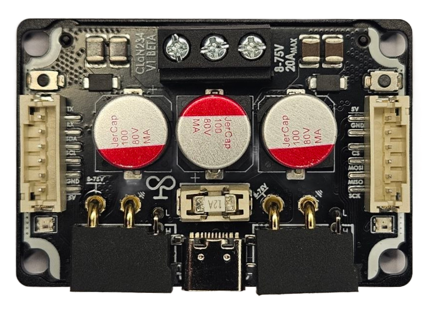

# CLN - CLOSED-LOOP DRIVERS FOR NEMA MOTORS

    

The CLN motor driver series is an **open-source** project aimed at creating a range of compact, cost-efficient high-performance closed-loop stepper drivers for various NEMA form factor motors. These drivers are designed to provide silent and smooth motion, high-precision position control, and energy-saving capabilities, suitable for a wide array of applications in robotics, CNC machines, 3D printers, and more.

## Key Features

- 🕹️ **Closed-Loop Control:** Integrates an encoder for real-time position monitoring, ensuring precise and safe motion.
- 📏 **Fine Positioning:** Achieves high position control accuracy of 0.01° for smooth operation.
- 🛡️ **Reliable Operation and Enhanced Safety:** Features integrated diagnostic and protection mechanisms for the motor and the user safety.
- 🧩 **Modular Concept:** Offers various configurations for different cost, size and performance needs, supporting expansion boards and daisy chain connections.

## Applications

- 🎓 Learning Platforms
- 🛠️ CNC Machines & 3D printers
- 🤖 Robotics & Automation Systems
- 🤝 Collaborative Robots
- 🔭 Camera & Telescope Stabilization Systems
- 🔬 Laboratory Equipment
- 🏭 Industrial Motion Control Systems
- 📳 Haptics & Force Feedback Systems

## Repository Structure

- **[`wiki`](wiki)**: includes design documentation and other information
- **[`hardware`](hardware)**: contains design source files, manufacturing files, schematics, block diagrams and 3D models

## Firmware

The following options are available:

- **[CLN-SimpleFOC](https://github.com/AntonEvmenenko/CLN-SimpleFOC):** SimpleFOC based firmware for CLN. Pretty stable, ready to use
- **[TunePulse](https://github.com/creapunk/TunePulse):** Firmware for CLN and RadiX motor drivers. Currently a work in progress; estimated release date is to be determined

## Hardware Versions

#### [NEMA17 dedicated drivers](./wiki/CLN17/readme.md)

- **[`CLN17 V3.0`](hardware/CLN17/V3.0)** [active]: newest version with best performance and BLDC support [[wiki]](./wiki/CLN17/V3.0/specification.md). 
  
  > - **Key info:** Discrete MOSFET based, 6-48V 3.2ARMS 4.5APEAK, up to 60W output power, 21bit position feedback, dual-sided SMD only assembly
  > - **Supported interfaces:** STEP-DIR-EN, USB, CAN-FD, USART, I2C, SPI, ABZ
  > - **Supported motors:** Stepper, 3phase BLDC/PMSM
  >
  > 
  
  
  
  

##### OBSOLETE / NRFND

**[`CLN17 V1.0`](hardware/CLN17/V1.0 [OBSOLETE])** [obsolete]: pilot version [[wiki]](./wiki/CLN17/V1.0/specification.md)

**[`CLN17 V1.5`](hardware/CLN17/V1.5 [OBSOLETE])** [tested]: cost-efficient version [[wiki]](./wiki/CLN17/V1.5/specification.md)

**[`CLN17 V2.0`](hardware/CLN17/V2.0 [NRFND])** [tested]: high voltage version [[wiki]](./wiki/CLN17/V2.0/specification.md). 
**[`CLN17 V2.1`](hardware/CLN17/ [NRFND])** is improved version

**[`CLN17 V2.5`](hardware/CLN17/V2.5 [NRFND])** [tested]: meant to be final version but will be skipped

***Important Note:** Obsolete designs will not be supported in future*

#### NEMA23 and NEMA34 dedicated drivers

- **[`CLN234 V1`](hardware/CLN234/V1.0)** [under tests]: powerful and versatile [[wiki]](./wiki/CLN234/V0.1/specification.md)

	> **Key info:** external MOSFETs, 8-75V 10ARMS 20APEAK, up to 1000W output power, 21bit position feedback, 56x38x18mm, fits into Ø60mm
	>
	> **Supported interfaces:** STEP-DIR-EN, USB, CAN-FD, USART, I2C, SPI, ABZ
	
	

#### Modular drivers dedicated for embedded systems

Jump to the [RadiX project repository](https://github.com/creapunk/RadiX)

## Supporting the Project

If this project resonates with you, please consider the following ways to support its development:

- **[Ko-fi](https://ko-fi.com/creapunk):** Preferred for membership subscription and one-time donation
- **[Patreon](https://patreon.com/creapunk):** Alternative platform with higher fees
- **Join [Discord community](https://discord.gg/V4aJdTja8v):** Stay updated, engage in discussions, and contribute to the project

**Your contribution, regardless of size, is greatly appreciated!** 

*A heartfelt thank you to [everyone who supports this project](sponsors.md)!*

---

***Important Note:** This README will be updated to reflect the latest progress and changes in the project*.

